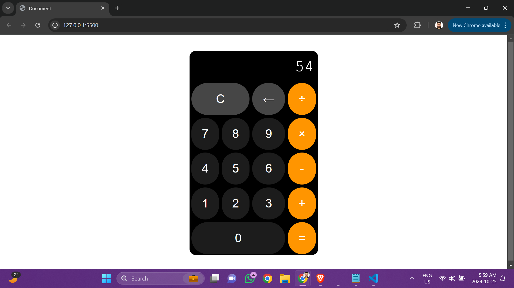
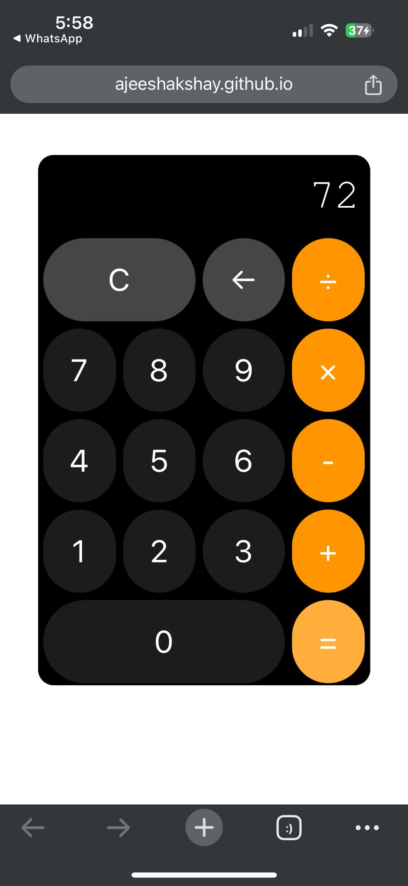

# FrontEnd Masters - pro-calculator
A sleek, Apple-style calculator built with HTML, CSS, and JavaScript. It supports basic operations like addition, subtraction, multiplication, and division. Includes a C button to clear input and a backspace feature to correct mistakes. Added a touch of new apple design from the asked previous version

## Table of contents

- [Overview](#overview)
  - [Screenshot](#screenshot)
  - [Links](#links)
- [My process](#my-process)
  - [Built with](#built-with)
  - [What I learned](#what-i-learned)
- [Author](#author)
- [Acknowledgments](#acknowledgments)

## Overview

### Screenshot

The above are the screenshots of desktop version

The above are the screenshots of tablet version

The above is the screenshot of mobile(iphone 14 pro) version

### Links

- Live Site URL: [https://ajeeshakshay.github.io/pro-calculator/]

## My process

### Built with

- Semantic HTML5 markup
- CSS custom properties
- Flexbox
- CSS Grid
- Java Script

### What I learned

I tried to create the latest version design of Apple calculator. I am seeing improvement in my CSS skills especially with the CSS grids.

Strating to understand JS queries step by step.

## Author

- Github - [Akshay Ajeesh](https://github.com/ajeeshakshay)
- Frontend Mentor - [@ajeeshakshay](https://www.frontendmentor.io/profile/ajeeshakshay)
